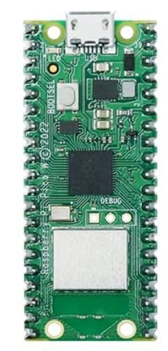
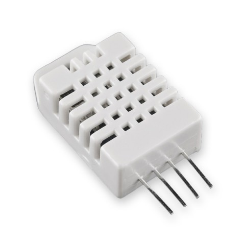
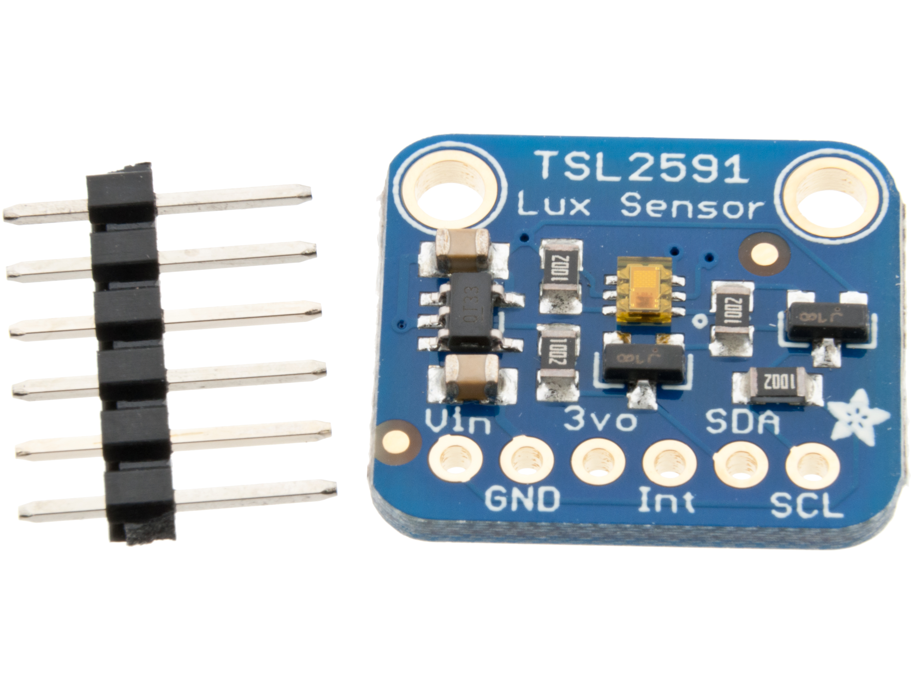
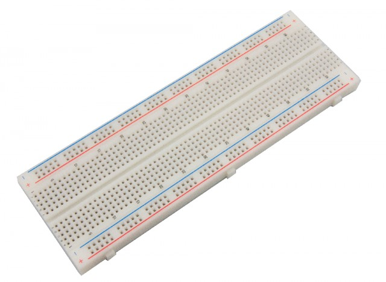
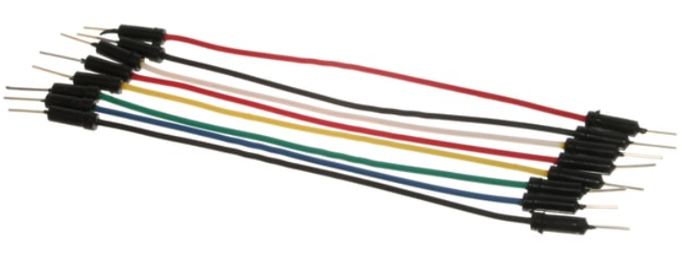
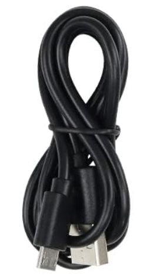
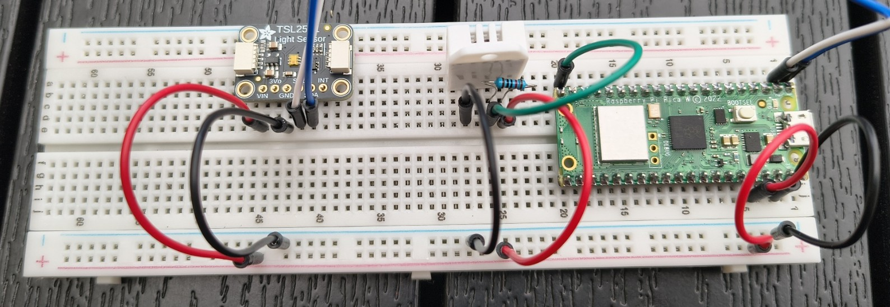
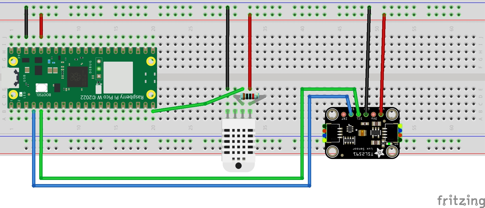
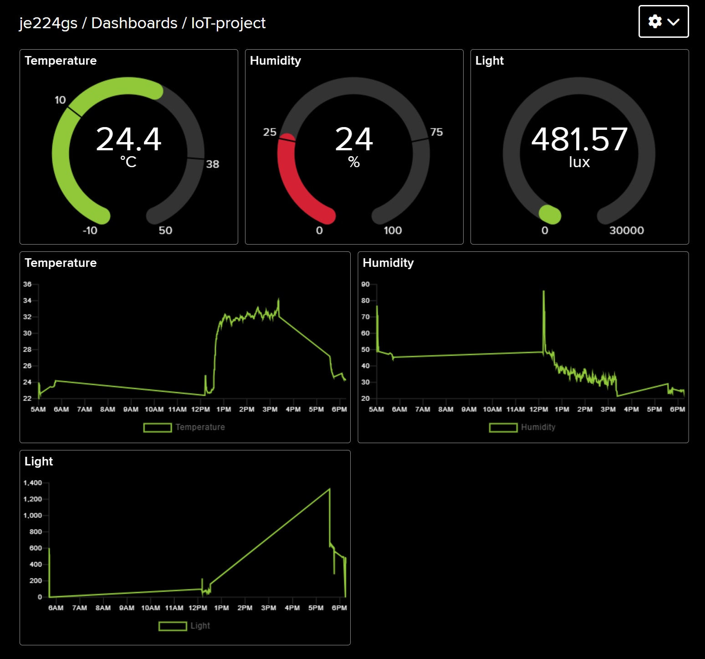

# Tutorial on how to build a temperature, humidity, and light sensor

## Project Title

Greenhouse Summer Monitoring with Raspberry Pi Pico W and Adafruit IO

**Author**: Johanna Eriksson (je224gs)

**Project Overview**:
This project is about creating a wireless monitoring system for a greenhouse using a Raspberry Pi Pico W microcontroller. It collects temperature, humidity, and light data from the environment using a DHT22 sensor and a TSL2591 light sensor. The collected data is sent to Adafruit IO, an online cloud platform, for visualization. The aim is to gather environmental data during the growing season to optimize the automatic watering system of the greenhouse.

**Time to complete**: Approx. 6–8 hours (initial setup, coding, testing, and deployment)

## Objective

I chose to build this device to better understand the environmental conditions in my greenhouse during the summer. With insights into temperature, humidity, and light intensity, I can fine-tune the irrigation schedule of my Gardena watering system. This helps conserve water and optimize plant growth.

The system also provides a great learning opportunity for working with sensors, MicroPython, and cloud dashboards. Future upgrades will involve adding soil moisture sensors and some automation triggers, possibly even building my own irrigation system.

## Material

I bought the course recommended starter kit from [Freenove](https://www.amazon.se/Freenove-Raspberry-Dual-core-Cortex-M0-Microcontroller/dp/B0BJ1QC6X8/ref=asc_df_B0BJ1QC6X8/?th=1). The cost is around ~360 SEK.

This kit includes many of the components listed below (not included is the DHT22 and TSL2591), but if you simply want to build this particular project you only need what is listed below.


| Image | Item | Purpose | Where Purchased | Cost |
| -------- | -------- | -------- | -------- | -------- |
|  | Raspberry Pi Pico W     | Main microcontroller     | Electrokit | ~89 SEK     |
|  | DHT22 sensor | Temp and humidity sensor | Electrokit | ~99 SEK |
|  | TSL2591 light sensor | Light intensity (lux) sensor | Electrokit | ~109 SEK |
|  | 10kΩ Resistor | Used as a pull-up resistor for DHT22 | Electrokit | ~1 SEK  |
|  | Breadboard | Circuit prototyping | Electrokit | ~70 SEK |
|   | Jumper wires | Circuit prototyping | Electrokit | ~45 SEK  |
|  | USB-A to Micro-USB Cable | Programming and power | Electrokit | ~40 SEK |
| – | Power bank (optional) | Portable deployment power source | Already owned | – |

**Sensor Specs**:

- **DHT22**: Combined temperature and humidity sensor, digital output
    * Power usage:  ~1 mA active, ~45 µA idle.
    * Humidity measuring range: 0 - 100% RH
    * Temperature measuring range: -40 till +80°C
    * Accuracy humidity (RH): ±2%
    * Accuracy temperature: ±0.5°C
- **TSL2591**: High dynamic range light sensor, I2C communication, lux value output
    * Temperature working range: -30 till +80°C
    * Light measuring range: 0.00018 - 88000 lux
    * I2C-adress: 0x29
    * Power usage: 400uA (during reading) / 5uA (while inactive)

## Computer Setup

**IDE**: Visual Studio Code (VSC)  
Make sure you have this installed before proceeding to the next steps.

**Steps**:

1. **Flashing the Raspberry Pi Pico W with MicroPython**
    1. Download the firmware from the official site [micropython.org](https://micropython.org/download/rp2-pico-w/)  
    Direct link to file [here](https://micropython.org/resources/firmware/RPI_PICO_W-20250415-v1.25.0.uf2)
    2. While holding the **BOOTSEL** button on your Pico connect the USB-cable from your Pico to your computer. You can release the button after connecting.
    3. Your Pico should appear as a removable USB drive in your file system.
    4. Copy the uf2 firmware file to this drive.
    5. Wait until the drive disappears from your system. Your Pico should now be updated.  
    (To verify you can reconnect the usb-cable, your pico should not appear in your file system.) 

3. **Setting up PyMakr in Visual Studio Code**
    1. Open VSC and install the PyMakr extension.
        - Open the Extensions panel (Ctrl+Shift+X)
        - Search for “PyMakr” and install it (by Pycom)
    2. Connect your Pico W
        - Navigate to the PyMakr tab.
        - Plug in your Raspberry Pico W while taking a look at the list of devices. The new device that pops up will be the Pico.
        - Hover your mouse over the device and press the lightning button to connect the Pico.
        - After the board is connected, hover over the device again and now press the terminal button to upen up a terminal.
        - You can test your device connection by typing print("Welcome!") after the >>>   
        You should see the same message printed back to you in the terminal.
3. **Upload files** directly to the Pico using PyMakr by hovering over the device and clicking the upload button.  

**Can't upload files?**  
With the terminal active hold CTRL + C. This will stop any code running on your Pico.  
Reboot can be done by holding CTRL + D.

**Dependencies**:  
These are the neccessary libraries for this project. Make sure you `import` these in your `main.py`

- `dht.py` for DHT22
- `TSL2591.py` from [Baelcorvus' repo](https://github.com/Baelcorvus/TSL2591-Micropython-I2C-Library-for-pico)
- `umqtt.simple` for MQTT support

## Putting Everything Together


*Breadboard testing setup.*

**Connections**:

- **DHT22**: Data pin to GPIO15, powered by 3.3V and GND
- **TSL2591**: SDA to GPIO2, SCL to GPIO3, powered by 3.3V and GND

**Circuit Diagram**:  


**Note**:

- Both sensors use digital interfaces (I2C for TSL2591, single-wire digital for DHT22)
- The DHT22 requires a 10kΩ pull-up resistor connected between the data pin and VCC (3.3V). This resistor ensures the data line is pulled to a high logic level (3.3V) when not actively driven low by the sensor, preventing floating states and ensuring reliable digital communication
- TSL2591 uses I2C protocol with built-in pull-up resistors on the Pico, so no external resistors needed
- I2C devices must not share conflicting addresses (TSL2591 uses address 0x29)

## Platform

**Platform Used**: Adafruit IO (cloud-based)

**Why**:

- Easy MQTT integration
- Free tier is sufficient for small projects
- Clean dashboard interface

**Alternatives considered**: MIG stack (MQTT - Influx - Grafana) but that would require additional backend setup, so I skipped that.

Adafruit IO handles MQTT feed creation, data retention (30 days for free tier), and offers automation rules and public dashboards.

## The Code

**Code Repository**: [GitHub](https://github.com/kkwydragonflame/LNU-IoT-project)

**Core functionality**:
```python
# Main loop
def main():
    # Connect to Wi-Fi
    connect_wifi()

    # Connect to MQTT broker
    mqtt_client = connect_mqtt()

    # Read sensors
    while True:
        temperature, humidity = read_dht22()
        lux = read_lux()
        weather_condition = lux_to_weather_condition(lux)

    # Send the data to the MQTT broker
        if temperature is not None and humidity is not None:
            # Only send lux data if sensor is working
            if lux is not None:
                send_data(mqtt_client, temperature, humidity, lux, weather_condition)
            else:
                # Send only temp/humidity if lux sensor not working
                mqtt_client.publish(secrets['AIO_FEED_TEMPERATURE'], str(temperature))
                mqtt_client.publish(secrets['AIO_FEED_HUMIDITY'], str(humidity))
                print(f"Published temperature: {temperature}°C, humidity: {humidity}% (no lux sensor)")
        else:
            print("Failed to read sensor data.")

        # Wait before the next reading
        time.sleep(10)
```
- Wi-Fi connected using `network.WLAN`
- MQTT via `umqtt.simple`
- TLS2591 uses external library (I2C-based)

## Transmitting the Data / Connectivity

**Transmission Details**:
- Protocol: MQTT
- Wireless: Wi-Fi (2.4GHz)
- Interval: Every 10 seconds
- MQTT payload: simple string

**Design Note**:
While Wi-Fi is convenient, range is an issue in an outdoor greenhouse. A mesh Wi-Fi repeater have been used to solve this. Alternatively, LoRa is better suited for long-range, low-power, but requires additional setup.

## Presenting the Data

See the data live [here](https://io.adafruit.com/je224gs/dashboards/iot-project)!

**Dashboard**: Built in Adafruit IO

- Graphs and gauges for each feed
- Retains data history for 30 days (free tier)
- Dashboards are customizable and sharable



**Database**: Cloud storage provided by Adafruit

**Automation**: Adafruit IO supports triggers, such as email alerts if temp exceeds threshold and Discord notifications.

## Finalizing the Design

**Final Thoughts**:  
This project will hopefully achieve its goal of providing real-time greenhouse data over the summer. The setup is reliable, extensible, and beginner-friendly.  
Using Adafruit IO simplified the visualization process, but for longer data retention I will setup a custom MIG stack backend.

**Future Improvements**:

- Add battery power and deep sleep
- Add soil moisture sensor and rain sensor
- Try long-range LoRa for improved connectivity
- Setup custom MIG stack for longer data retention
- Add solar charging system for sustainable battery operation
- Add alerts for high temperatures.
